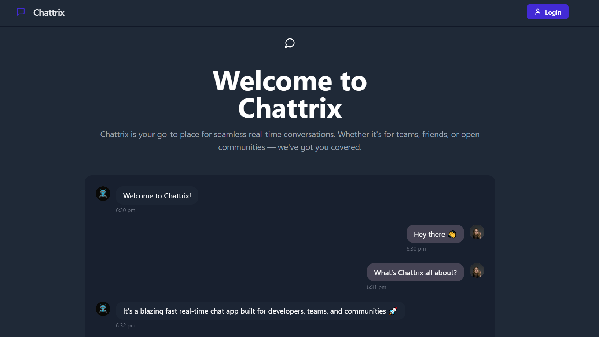

:

💬 Chattrix
Chattrix is a sleek, modern, and real-time chat application built for both individual and group conversations. Designed with performance and usability in mind, Chattrix is perfect for anyone who wants seamless communication with a smooth UI and powerful backend.

🚀 Features
👥 User Authentication
Secure signup and login with JWT

Google OAuth integration (coming soon)

Cookie-based session management

💬 Real-Time Messaging
Instant one-to-one messaging

WebSocket-based real-time updates

Read receipts and typing indicators (optional feature)

👨‍👩‍👧‍👦 Group Chats
Create and join group conversations

Real-time group messaging

Group name & member management

📦 Tech Stack
Frontend: Vite + React + TypeScript + TailwindCSS

Backend: Express.js + Socket.io + MongoDB + TypeScript

Database: MongoDB (with Mongoose ORM)

Deployment: Docker + Nginx + Docker Compose

🌐 Live Demo
Coming soon...

<!-- Optionally include GIF demo here -->
📸 UI Screenshots
Login Page	Chat Page	Group Chat

<!-- Replace with your actual screenshots -->
📁 Folder Structure
pgsql
Copy
Edit
chattrix/
├── backend/
│   ├── routes/
│   ├── controllers/
│   ├── models/
│   ├── lib/
│   ├── seeds/
│   └── server.ts
├── frontend/
│   ├── src/
│   ├── public/
│   └── index.html
├── docker-compose.yml
└── README.md
⚙️ Getting Started
1️⃣ Clone the repository
bash
Copy
Edit
git clone https://github.com/your-username/chattrix.git
cd chattrix
2️⃣ Environment Variables
Create .env files in both backend/ and frontend/:

Backend .env:

env
Copy
Edit
PORT=3000
MONGO_URI=your_mongodb_uri
JWT_SECRET=your_secret
frontendUrl=http://localhost:8181
NODE_ENV=development
Frontend .env:

env
Copy
Edit
VITE_API_URL=http://localhost:3000
3️⃣ Run with Docker
bash
Copy
Edit
docker-compose up --build
Visit:

Frontend: http://localhost:8181

Backend: http://localhost:3000

🛠️ Available Scripts
Backend:

bash
Copy
Edit
cd backend
npm run dev        # Development
npm run build      # Build production
Frontend:

bash
Copy
Edit
cd frontend
npm run dev        # Start Vite dev server
npm run build      # Build for production
🤝 Contributing
Pull requests are welcome! Please follow the standard code style and include relevant tests when possible.

📃 License
MIT © Rishi Yadav

